# Project_template

# Задание 1. Анализ и планирование

### 1. Описание функциональности монолитного приложения

**Управление отоплением:**
- Пользователи могут удалённо включать/выключать систему отопления в своих домах через веб-интерфейс
- Управление реализовано через изменение статуса сенсора (например, установка статуса "active" для включения)
- Все операции выполняются синхронно: сервер напрямую отправляет команды на модули управления отоплением
- Поддерживается только бинарное состояние (вкл/выкл)
- Для подключения системы обязателен выезд специалиста компании
- К системе подключены 100 модулей управления отоплением и 100 веб-клиентов

**Мониторинг температуры:**
- Система получает данные с датчиков через синхронные HTTP-запросы
- Пользователи могут просматривать текущую температуру в домах через веб-интерфейс в реальном времени
- Данные получаются синхронно: сервер запрашивает показания с датчиков по требованию
- Система хранит исторические данные о температуре в PostgreSQL
- Поддерживается только один тип датчиков - температурные
- Отсутствует исторический анализ данных и интеграция с другими метриками
- Интеграция с внешним API для получения показаний температуры
- Поддерживается поиск по местоположению (`GET /api/v1/sensors/temperature/:location`)

### 2. Анализ архитектуры монолитного приложения

#### **1. Схема приложения**

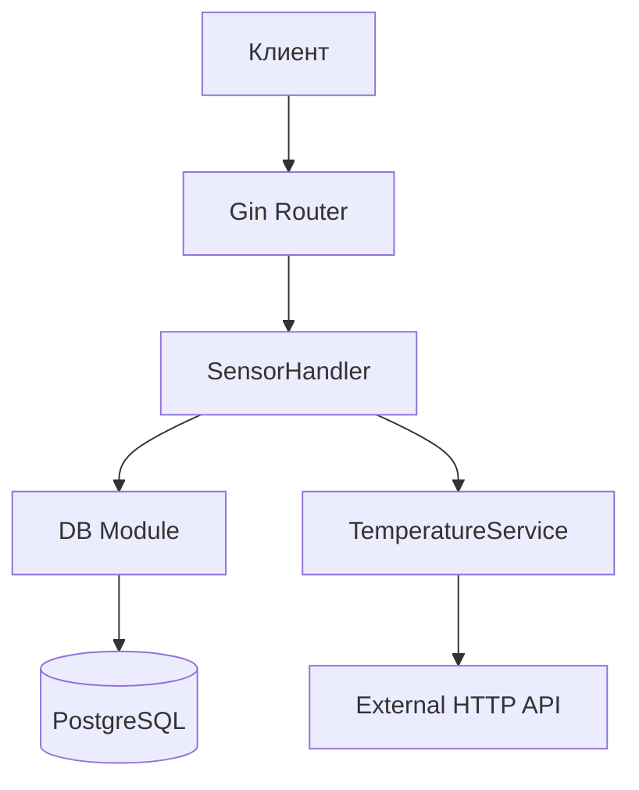
```mermaid
flowchart TD
    A[Клиент] --> B[Gin Router]
    B --> C[SensorHandler]
    C --> D[DB Module]
    D --> E[(PostgreSQL)]
    C --> F[TemperatureService]
    F --> G[External HTTP API]
```

#### **2. Основные характеристики системы:**
| **Компонент**           | **Технология/Подход**             | **Описание**                                                                 |
|--------------------------|-----------------------------------|-----------------------------------------------------------------------------|
| Язык программирования    | Go (Golang)                       | Используется для backend-разработки, обеспечивая высокую производительность |
| База данных              | PostgreSQL                        | Реляционная СУБД для хранения информации о сенсорах и их состояниях        |
| Архитектура приложения   | Монолитная                        | Все компоненты развёрнуты как единое исполняемое приложение                |
| Стиль взаимодействия     | Синхронный REST API               | Блокирующие HTTP-вызовы между компонентами и внешними сервисами            |
| Коммуникация с устройствами| Прямые HTTP-запросы              | Сервер инициирует запросы к устройствам без промежуточных брокеров         |
| Развёртывание            | Docker Compose                    | Контейнеризация приложения и БД через единый скрипт `init.sh`              |

#### **3. Организация кодовой базы:**
```plaintext
smart_home/
├── db/             # Работа с БД (CRUD операции)
│   └── db.go
├── handlers/       | HTTP-обработчики (REST API)
│   └── sensors.go  | 
├── models/         | Доменные модели (сущности)
│   └── sensor.go   | 
└── services/       | Интеграция с внешними сервисами
    └── temperature_service.go
```

#### **4. Sequence-diagram**

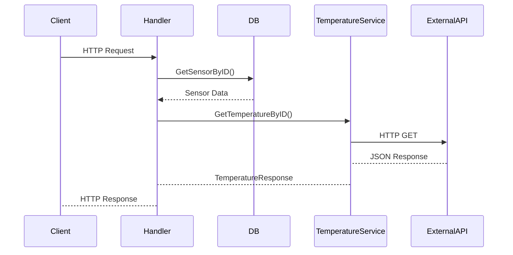
```mermaid
sequenceDiagram
    participant Client
    participant Handler
    participant DB
    participant TemperatureService
    participant ExternalAPI

    Client->>Handler: HTTP Request
    Handler->>DB: GetSensorByID()
    DB-->>Handler: Sensor Data

    Handler->>TemperatureService: GetTemperatureByID()
    TemperatureService->>ExternalAPI: HTTP GET
    ExternalAPI-->TemperatureService: JSON Response
    TemperatureService-->Handler: TemperatureResponse

    Handler-->Client: HTTP Response
```

### 3. Определение доменов и границы контекстов

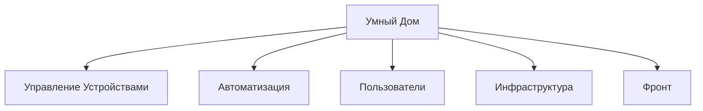
```mermaid
graph TD
    A[Умный Дом] --> B[Управление Устройствами]
    A --> D[Автоматизация]
    A --> E[Пользователи]
    A --> G[Инфраструктура]
    A --> I[Фронт]
```

#### 1. Домен "Управление Устройствами"
**Ответственность:**

- Регистрация и жизненный цикл IoT-устройств
- Управление конфигурацией устройств
- Состояние подключения и статус устройств
- Классификация устройств по типам (сенсоры, реле, контроллеры)
    

**Границы контекста:**
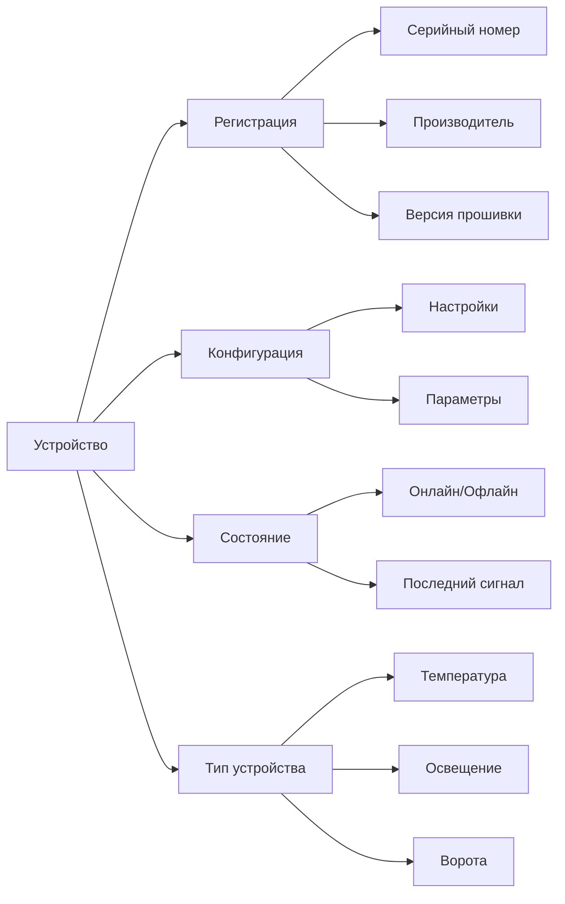
```mermaid
graph LR
    A[Устройство] --> B[Регистрация]
    A --> C[Конфигурация]
    A --> D[Состояние]
    A --> E[Тип устройства]
    
    B --> F[Серийный номер]
    B --> G[Производитель]
    B --> H[Версия прошивки]
    
    C --> I[Настройки]
    C --> J[Параметры]
    
    D --> K[Онлайн/Офлайн]
    D --> L[Последний сигнал]
    
    E --> M[Температура]
    E --> N[Освещение]
    E --> O[Ворота]
```

**Ключевые элементы:**
- Агрегат `Device` (корневой объект)
- Сервисы: `DeviceRegistrationService`, `DeviceConfigurationService`
- Репозиторий: `DeviceRepository`
- События: `DeviceRegistered`, `DeviceStatusChanged`
    
#### 2. Домен  **"Автоматизация"**

**Ответственность:**

- Управление сценариями автоматизации
- Обработка триггеров и условий
- Выполнение действий
- Мониторинг выполнения сценариев
    

**Границы контекста:**

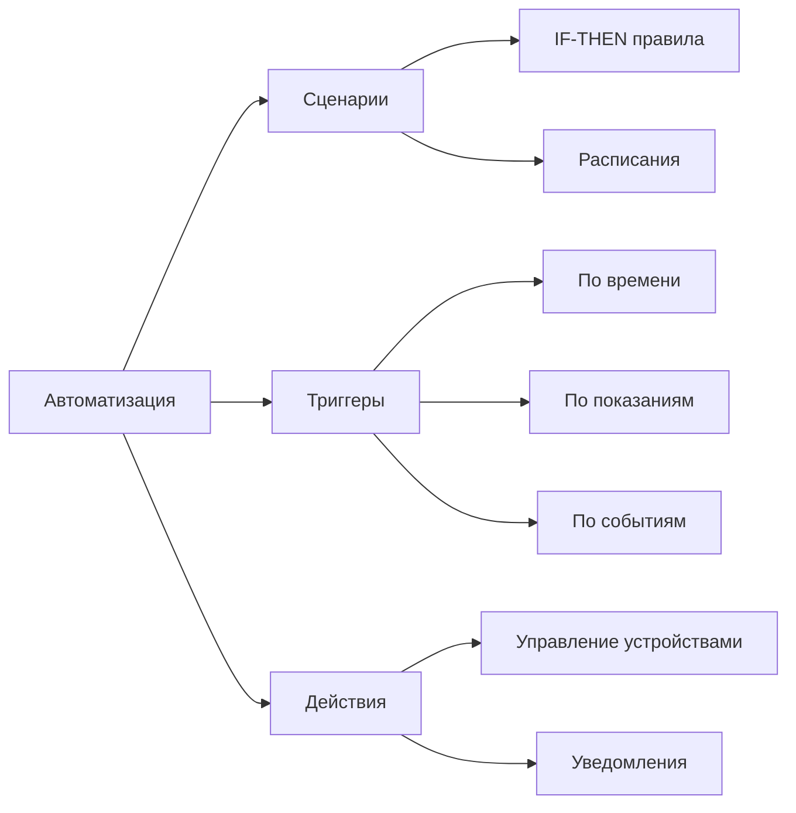
```mermaid
graph LR
    A[Автоматизация] --> B[Сценарии]
    A --> C[Триггеры]
    A --> D[Действия]
    
    B --> E[IF-THEN правила]
    B --> F[Расписания]
    
    C --> G[По времени]
    C --> H[По показаниям]
    C --> I[По событиям]
    
    D --> J[Управление устройствами]
    D --> K[Уведомления]
```
    
#### 3. Домен  **"Пользователи и Доступ"**

**Ответственность:**
- Управление пользователями и организациями
- Аутентификация и авторизация
- Контроль доступа к устройствам
- Мультитенантность
    
**Границы контекста:**

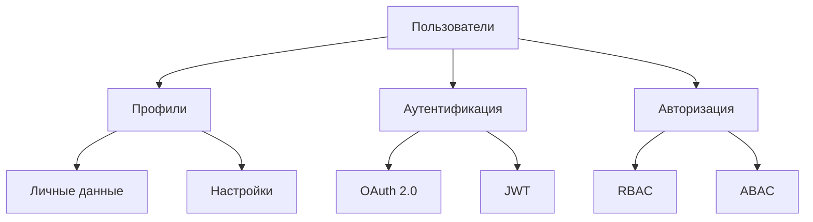
```mermaid
graph TD
    A[Пользователи] --> B[Профили]
    A --> C[Аутентификация]
    A --> D[Авторизация]
    
    B --> E[Личные данные]
    B --> F[Настройки]
    
    C --> G[OAuth 2.0]
    C --> H[JWT]
    
    D --> I[RBAC]
    D --> J[ABAC]
```
    
#### 4. Домен  **"Управление Инфраструктурой"**

**Ответственность:**
- Мониторинг состояния системы
- Управление обновлениями
- Конфигурация среды
- Обработка ошибок
- Интеграция с партнерскими устройствами
    
**Границы контекста:**

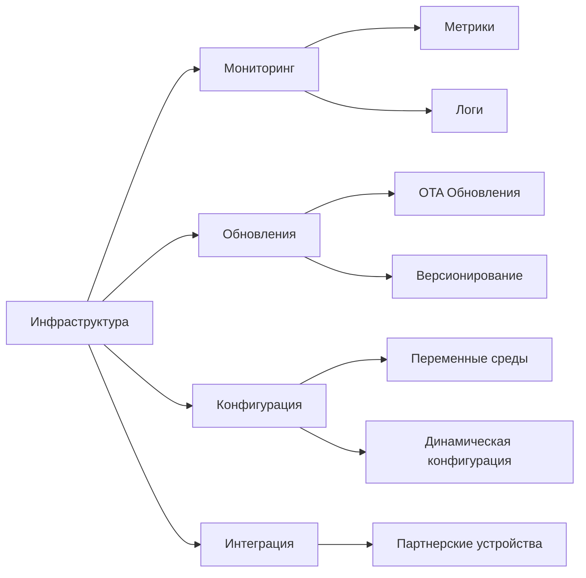
```mermaid
graph LR
    A[Инфраструктура] --> B[Мониторинг]
    A --> C[Обновления]
    A --> D[Конфигурация]
    A --> K[Интеграция]
    
    B --> E[Метрики]
    B --> F[Логи]
    
    C --> G[OTA Обновления]
    C --> H[Версионирование]
    
    D --> I[Переменные среды]
    D --> J[Динамическая конфигурация]

    K --> O[Партнерские устройства]
    
```

#### 5. Домен  **"Фронт"**

**Ответственность:**
- Предоставление интерфейсов для взаимодействия с системой:
    - **Web UI** — для пользователей (управление устройствами, просмотр телеметрии, настройка сценариев).
    - **Mobile App** — для монтажников (регистрация устройств, диагностика подключения).
    - **Admin Panel** — для администраторов (управление пользователями, мониторинг системных метрик).
- Поддержка разных ролей (пользователь, монтажник, администратор) с ограниченными правами.
- Интеграция с API Gateway для аутентификации и вызова backend-сервисов.
    
**Границы контекста:**

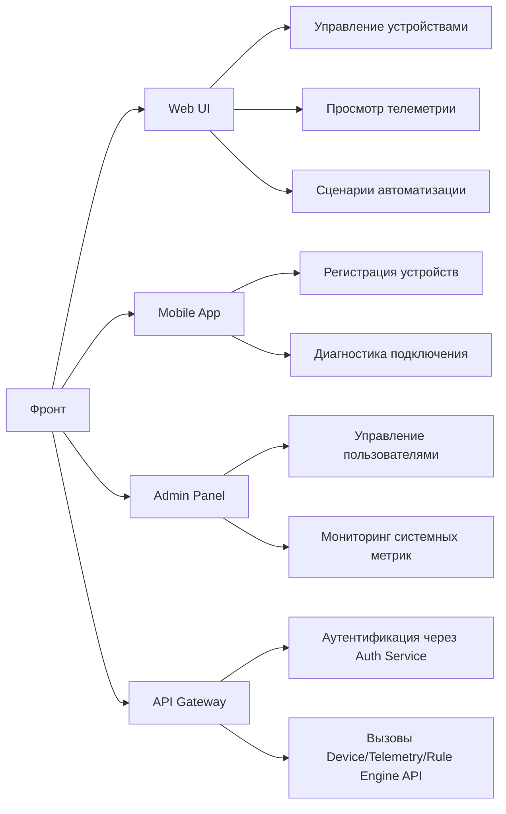
```mermaid
graph LR
    A[Фронт] --> B[Web UI]
    A --> C[Mobile App]
    A --> D[Admin Panel]
    A --> E[API Gateway]
    
    B --> F[Управление устройствами]
    B --> G[Просмотр телеметрии]
    B --> H[Сценарии автоматизации]
    
    C --> I[Регистрация устройств]
    C --> J[Диагностика подключения]
    
    D --> K[Управление пользователями]
    D --> L[Мониторинг системных метрик]
    
    E --> M[Аутентификация через Auth Service]
    E --> N[Вызовы Device/Telemetry/Rule Engine API]
```

### **4. Проблемы монолитного решения**

#### 1. **Архитектурные проблемы**
| **Проблема**                | **Описание**                                                                 | **Последствия**                                                                 |
|-----------------------------|-----------------------------------------------------------------------------|--------------------------------------------------------------------------------|
| **Высокая связанность**     | Все компоненты тесно интегрированы в одном процессе                         | Невозможно обновить одну функцию без пересборки всего приложения               |
| **Отсутствие модульности**  | Нет четких границ между доменами (устройства, телеметрия, пользователи)     | Сложность добавления новых типов устройств (освещение, ворота)                 |
| **Блокирующая архитектура** | Синхронные вызовы ко всем зависимостям                                      | Весь сервер блокируется при недоступности одного датчика или внешнего API      |

#### 2. **Проблемы масштабируемости**
| **Проблема**                     | **Пример из кода**                                                                 | **Ограничение**                                       |
|----------------------------------|-----------------------------------------------------------------------------------|------------------------------------------------------|
| **Вертикальное масштабирование** | Один экземпляр приложения обрабатывает все запросы                                 | Максимум 500-1000 одновременных подключений         |
| **Отсутствие шардирования**      | Все устройства хранятся в одной таблице `sensors`                                 | Боттлнек на запросах при >10K устройств              |
| **Проблемы с состоянием**        | Статус устройств хранится в БД без кэширования                                    | Частые запросы к PostgreSQL снижают производительность |

#### 3. **Проблемы производительности**
```go
// handlers/sensors.go - Критический участок кода
func (h *SensorHandler) GetSensors(c *gin.Context) {
    sensors, err := h.DB.GetSensors(context.Background()) // Блокирующий вызов БД
    for i, sensor := range sensors {
        if sensor.Type == models.Temperature {
            // Синхронный вызов внешнего API для каждого датчика!
            tempData, err := h.TemperatureService.GetTemperatureByID(...)
            // ...
        }
    }
}
```
**Последствия:**
- Время ответа растёт линейно с количеством устройств (O(n))
- Один медленный датчик задерживает весь ответ
- Нет кэширования или пакетной обработки

#### 4. **Проблемы расширяемости функционала**
| **Требование**                 | **Проблема в монолите**                                                                 |
|--------------------------------|----------------------------------------------------------------------------------------|
| **Поддержка новых устройств**  | Требуется изменять ядро системы (добавлять новые типы в `SensorType`)                  |
| **Пользовательские сценарии**  | Нет инфраструктуры для выполнения правил (if temperature > 25 then turn off heating)   |
| **Самообслуживание**           | Отсутствует API для регистрации устройств конечными пользователями                     |

#### 5. **Операционные проблемы**
| **Проблема**               | **Доказательство из кода/инфраструктуры**                               | **Риск**                                                |
|----------------------------|-------------------------------------------------------------------------|--------------------------------------------------------|
| **Единая точка отказа**    | Остановка приложения = полная недоступность системы                    | Нарушение SLAs при обновлениях                         |
| **Сложное развертывание**  | `docker-compose up -d` останавливает всю систему                       | Простой 5-10 минут при каждом обновлении              |
| **Нулевая отказоустойчивость** | Нет репликации БД, нет механизмов повтора запросов                    | Потеря данных при сбоях                                |

#### 6. **Проблемы безопасности**
| **Уязвимость**                | **Пример из кода**                                                                 | **Риск**                                                                 |
|-------------------------------|-----------------------------------------------------------------------------------|--------------------------------------------------------------------------|
| **Отсутствие аутентификации** | Нет проверок доступа в обработчиках (`handlers/sensors.go`)                       | Любой может удалить устройства или изменить температуру                  |
| **Прямой доступ к БД**        | Один коннекшн пул для всех операций (`db/db.go`)                                  | SQL-инъекции через неправильное экранирование                           |
| **Конфиденциальные данные**   | Файл docker-compose.yml содержит секреты в открытом виде | Утечка секретов при компрометации репозитория                           |

#### 7. **Проблемы управления данными**
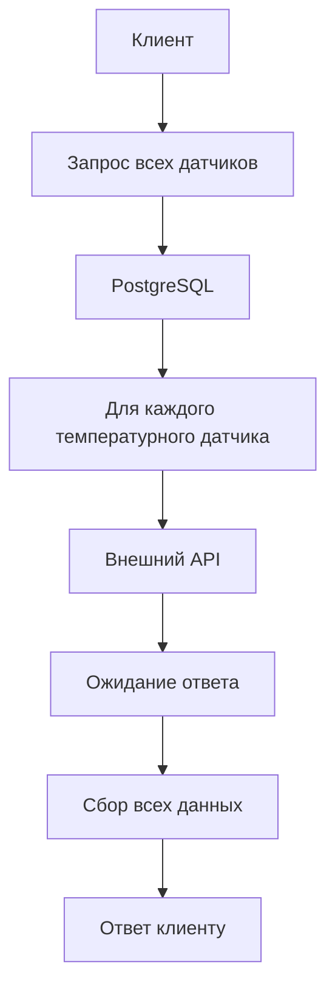
```mermaid
graph TD
    A[Клиент] --> B[Запрос всех датчиков]
    B --> C[PostgreSQL]
    C --> D[Для каждого температурного датчика]
    D --> E[Внешний API]
    E --> F[Ожидание ответа]
    F --> G[Сбор всех данных]
    G --> H[Ответ клиенту]
```
**Недостатки:**
- N+1 проблема: для N датчиков выполняется N+1 запросов
- Нормализация данных: все устройства в одной таблице
- Отсутствие истории показаний (только текущее значение)

### Критические проблемы для бизнеса
1. **Невозможность самообслуживания**
   - Требуется выезд специалиста для подключения
   - Нет API для самостоятельной регистрации устройств

2. **Блокировка развития экосистемы**
   - Нельзя добавить поддержку новых устройств без переписывания ядра
   - Нет механизма интеграции с устройствами партнёров

3. **Ограничение роста**
   - Максимум 500-1000 подключений на инстанс
   - Геораспределённость невозможна

4. **Риски безопасности**
   - Отсутствие RBAC/ABAC
   - Нет аудита действий
   - Потенциальные нарушения GDPR

### Заключение
Монолитная архитектура принципиально неспособна решить задачи:
- Поддержки >10 000 устройств
- Реализации модели SaaS с мультитенантностью
- Интеграции со сторонними устройствами
- Обеспечения 99.9% uptime

Ключевые точки отказа:
1. **Производительность:** Синхронные запросы к устройствам
2. **Масштабируемость:** Единая БД на все операции
3. **Безопасность:** Отсутствие концепции пользователей
4. **Гибкость:** Жёсткая модель данных устройств

Решение: Декомпозиция на микросервисы с чётким разделением ответственности и внедрением асинхронной коммуникации.

### 5. Визуализация контекста системы — диаграмма С4


[c4-containers.puml](schemas/c4-context.puml)

# Задание 2. Проектирование микросервисной архитектуры

## **Диаграмма контейнеров (Containers)**

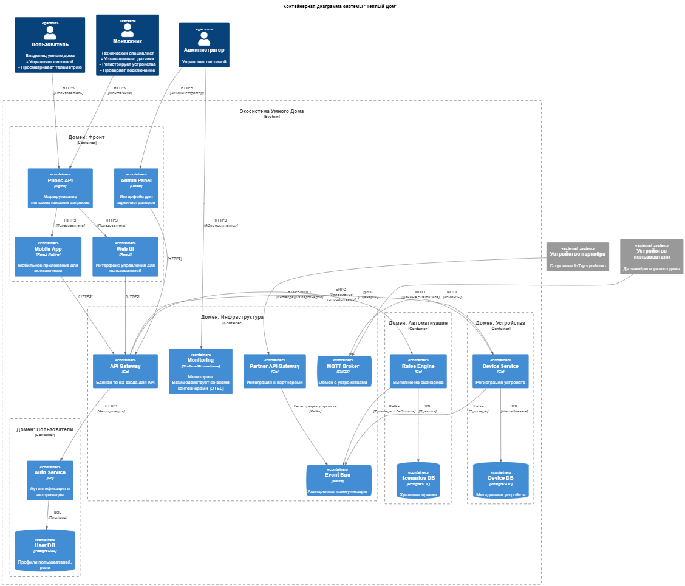

[c4-context.puml](schemas/c4/containers/c4-containers.puml)

## **Диаграмма компонентов (Components)**

### 1. API Gateway

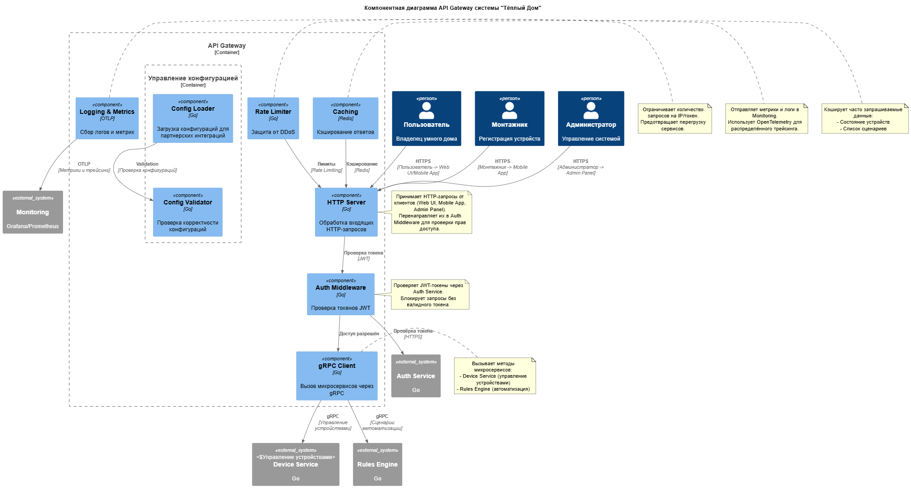

[c4-components-api-gateway.puml](schemas/c4/components/api-gateway.puml)

### 2. Auth Service

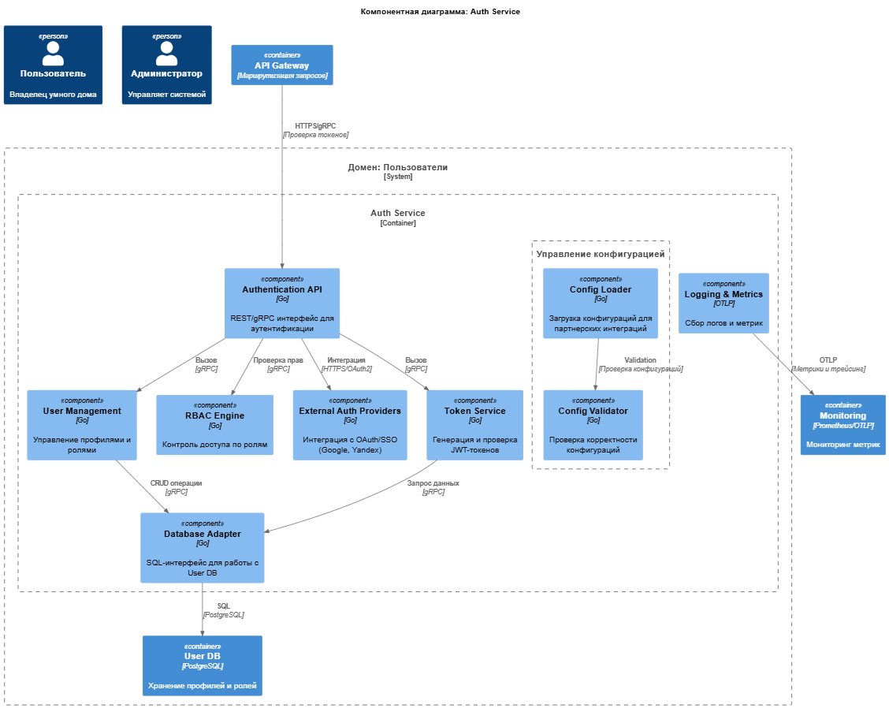

[c4-components-api-auth-service.puml](schemas/c4/components/auth_service.puml)

### 3. Device Service

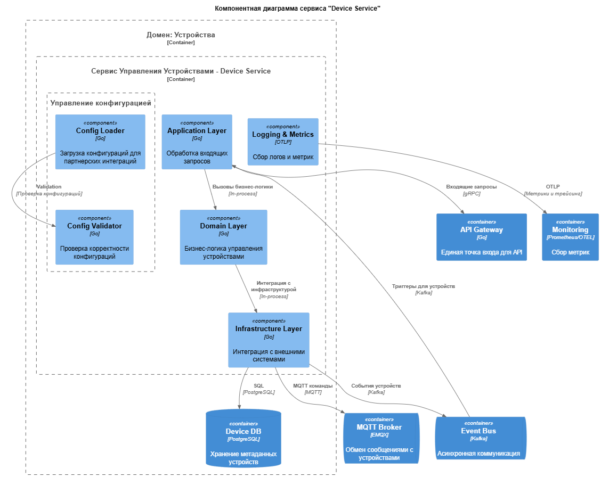

[c4-components-device-service.puml](schemas/c4/components/device-service-component.puml)

### 4. Partner-Api-Gateway

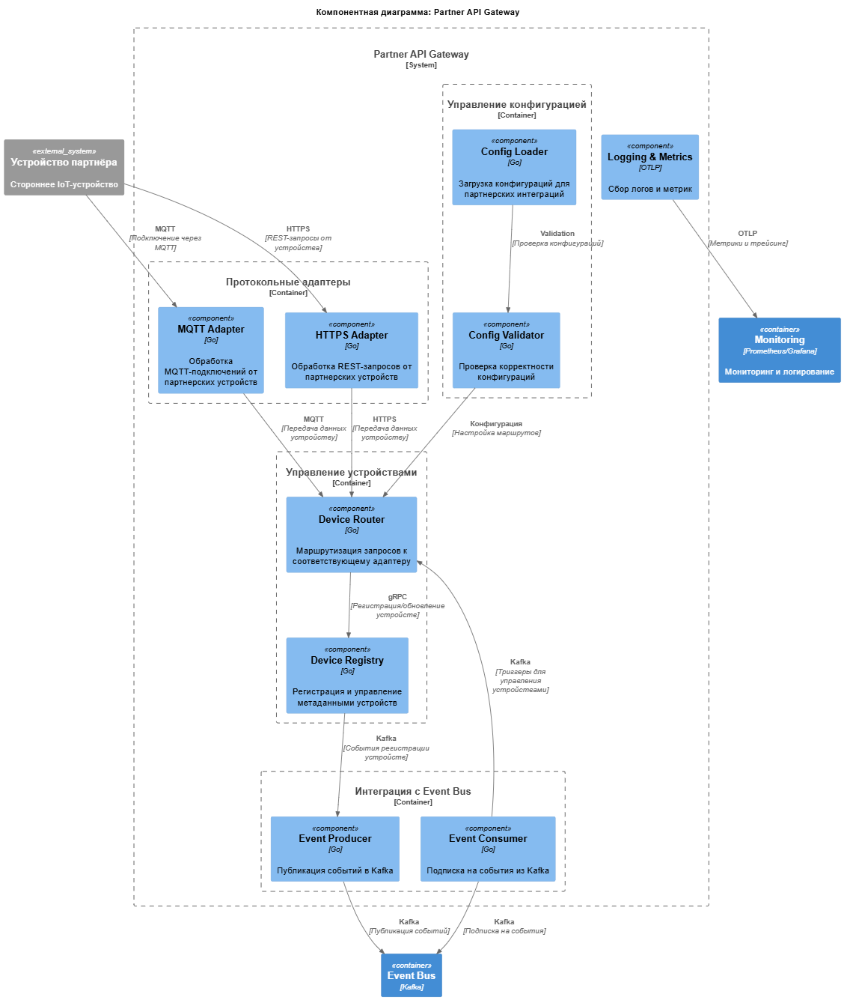

[c4-components-partner-api-gateway.puml](schemas/c4/components/partner-api-gateway.puml)

### 5. Rules Engine

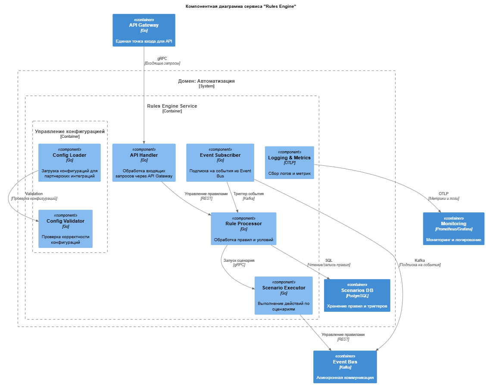

[c4-components-rules_engine.puml](schemas/c4/components/rules_engine.puml)

## **Диаграмма кода (Code)**

### 1. Device Service

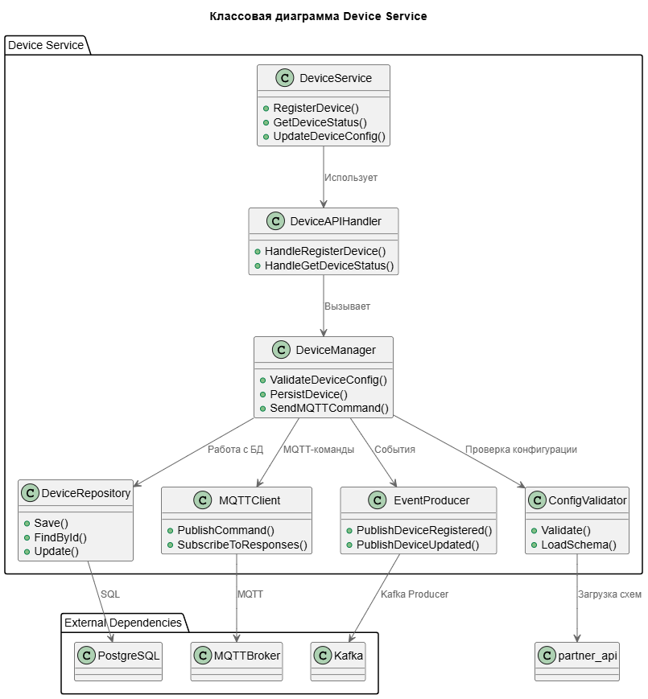

[c4-code-device-service-class.puml](schemas/c4/code/device-service/class.puml)

# Задание 3. Разработка ER-диаграммы

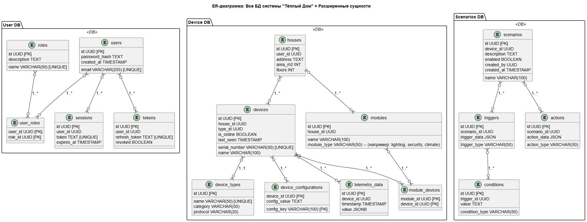

[c4-code-device-service-class.puml](schemas/er/er.puml)


# Задание 4. Создание и документирование API

### 1. Тип API

- Для взаимодействия между микросервисами внутри системы подойдет REST API.
- Асинхронное взаимодействие будет использоваться для взаимодействия с брокерами отправки команд управления и нотификации пользователей.

### 2. Документация API

[**Swagger**](openapi/openapi.yaml)

# Задание 5. Работа с docker и docker-compose

Перейдите в apps.

Там находится приложение-монолит для работы с датчиками температуры. В README.md описано как запустить решение.

Вам нужно:

1) сделать простое приложение temperature-api на любом удобном для вас языке программирования, которое при запросе /temperature?location= будет отдавать рандомное значение температуры.

Locations - название комнаты, sensorId - идентификатор названия комнаты

```
	// If no location is provided, use a default based on sensor ID
	if location == "" {
		switch sensorID {
		case "1":
			location = "Living Room"
		case "2":
			location = "Bedroom"
		case "3":
			location = "Kitchen"
		default:
			location = "Unknown"
		}
	}

	// If no sensor ID is provided, generate one based on location
	if sensorID == "" {
		switch location {
		case "Living Room":
			sensorID = "1"
		case "Bedroom":
			sensorID = "2"
		case "Kitchen":
			sensorID = "3"
		default:
			sensorID = "0"
		}
	}
```

2) Приложение следует упаковать в Docker и добавить в docker-compose. Порт по умолчанию должен быть 8081

3) Кроме того для smart_home приложения требуется база данных - добавьте в docker-compose файл настройки для запуска postgres с указанием скрипта инициализации ./smart_home/init.sql

Для проверки можно использовать Postman коллекцию smarthome-api.postman_collection.json и вызвать:

- Create Sensor
- Get All Sensors

Должно при каждом вызове отображаться разное значение температуры

Ревьюер будет проверять точно так же.


# **Задание 6. Разработка MVP**

Необходимо создать новые микросервисы и обеспечить их интеграции с существующим монолитом для плавного перехода к микросервисной архитектуре. 

### **Что нужно сделать**

1. Создайте новые микросервисы для управления телеметрией и устройствами (с простейшей логикой), которые будут интегрированы с существующим монолитным приложением. Каждый микросервис на своем ООП языке.
2. Обеспечьте взаимодействие между микросервисами и монолитом (при желании с помощью брокера сообщений), чтобы постепенно перенести функциональность из монолита в микросервисы. 

В результате у вас должны быть созданы Dockerfiles и docker-compose для запуска микросервисов. 